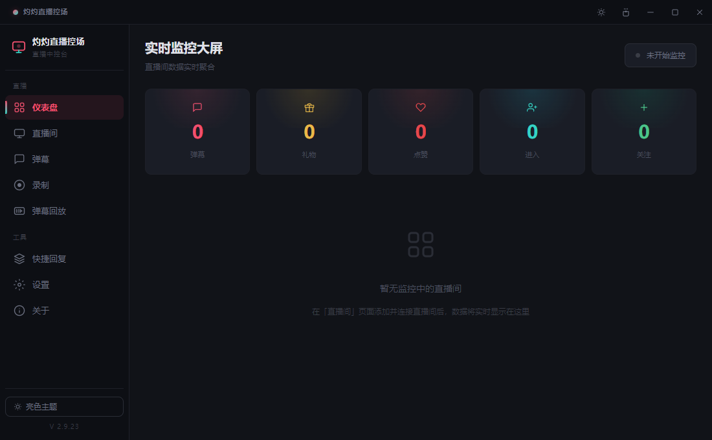
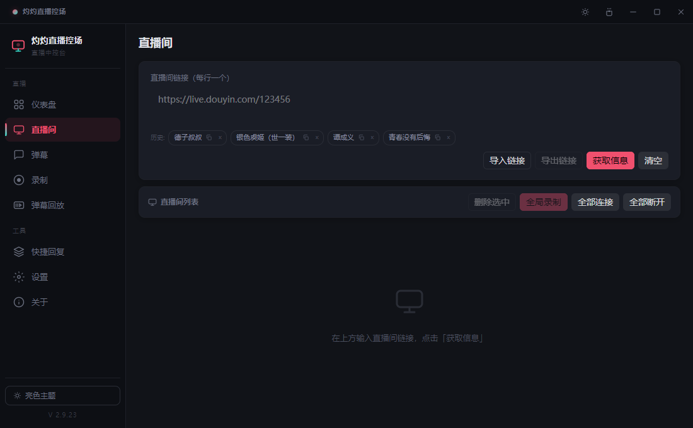
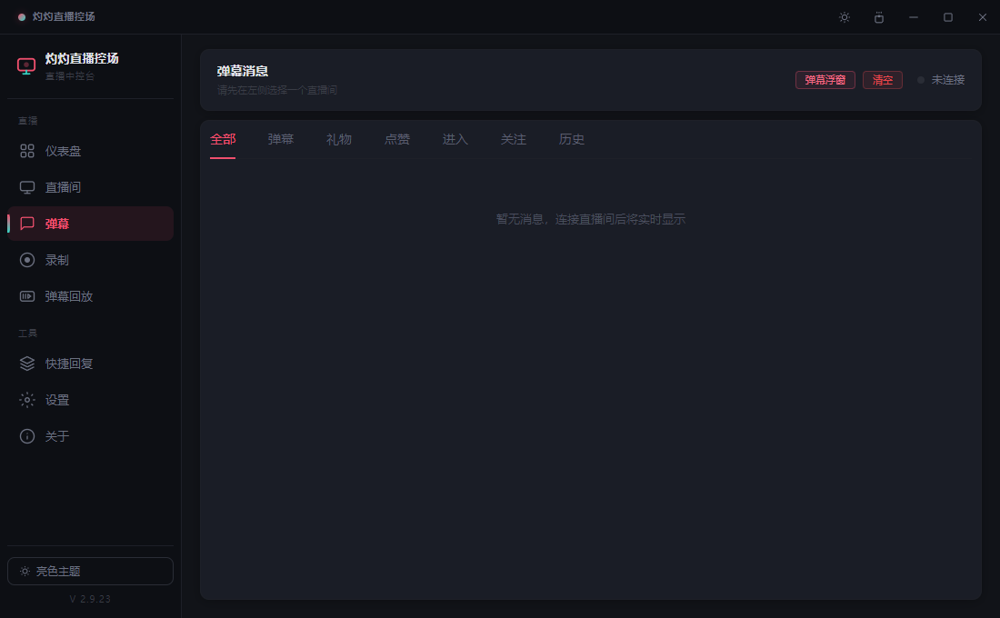
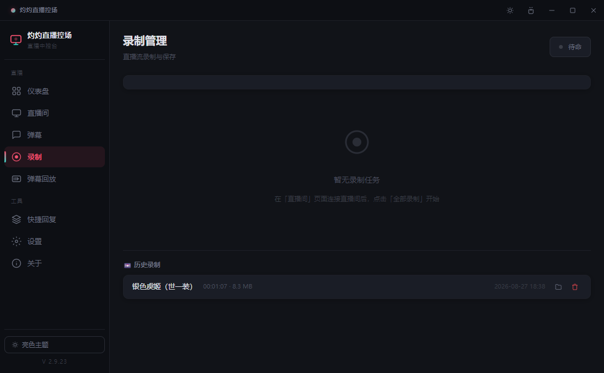
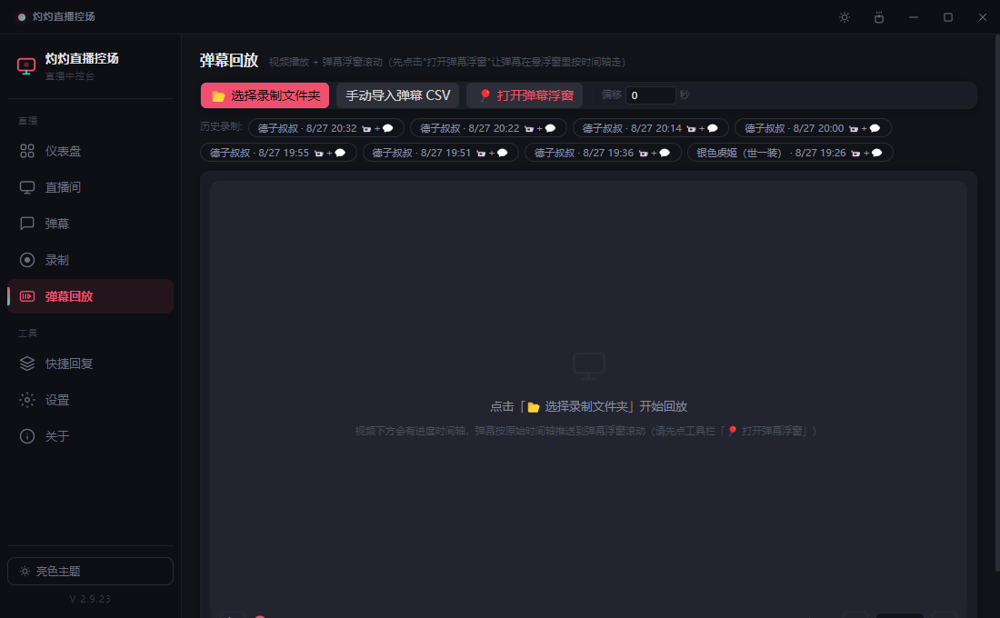
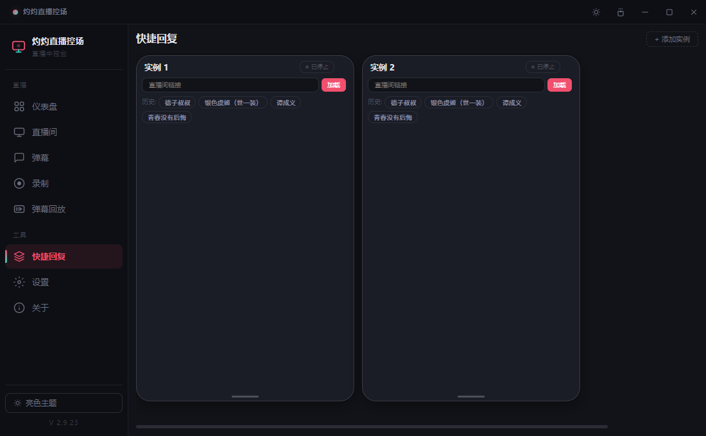
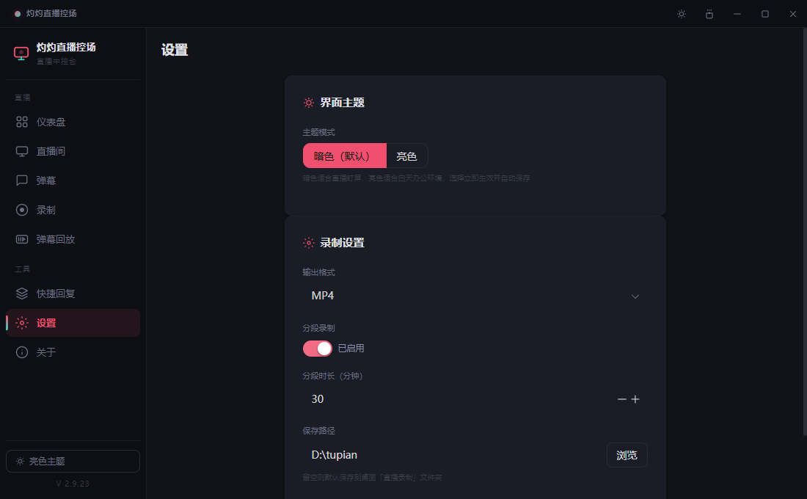
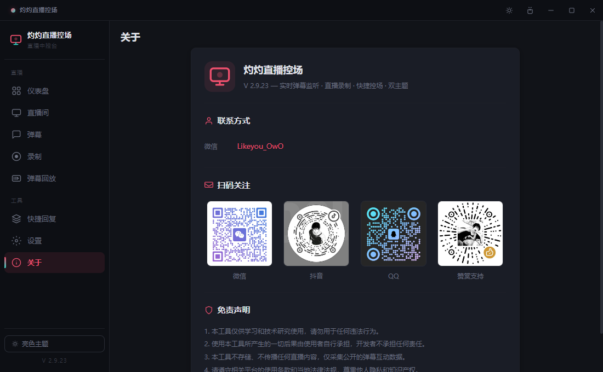

# 灼灼直播控场 (DouyinLiveInfo)

> 抖音直播间控场桌面工具 — 实时弹幕监听、数据统计、直播录制、快捷回复

[](https://github.com/coolestgaim/douyin-live-info-master/releases)


---

## 🚀 功能特色

| 功能 | 说明 |
| ------------ | --------------------------------------- |
| **🎯 多房间管理** | 同时添加多个直播间，批量获取房间信息，实时追踪在线状态 |
| **💬 实时弹幕** | WebSocket 连接监听弹幕、礼物、点赞、进房、关注等消息 |
| **📊 数据仪表盘** | 各房间弹幕/礼物/点赞/进房/关注数据实时聚合统计 |
| **🔍 弹幕过滤** | 按消息类型和房间筛选，历史弹幕搜索，导出 CSV/JSON |
| **🎥 直播录制** | 内置 ffmpeg 录制直播流，支持 MP3/MP4/WAV/FLV 格式，支持分段录制 |
| **📁 录制管理** | 历史录制记录面板，单房间多次录制不覆盖，一键打开文件夹/删除 |
| **📱 快捷回复** | 手机卡片布局，多分组管理，单区域编辑/发送，长按拖拽排序，长句自动省略号截断 |
| **🪟 弹幕浮窗** | 透明可筛选的悬浮窗，直播时浮在桌面上实时查看弹幕 |
| **💾 本地存储** | SQLite 本地存储所有弹幕记录，无需联网即可查看历史 |
| **🌙 暗色主题** | 深色 UI，基于 Naive UI 组件库，护眼设计 |

---

## 📸 截图（v2.9.29 实拍）

| 仪表盘 | 直播间 | 弹幕 |
| ------------------------------------ | ------------------------------------ | ------------------------------------ |
|  |  |  |

| 录制管理 | 弹幕回放 | 快捷回复 |
| ------------------------------------ | ------------------------------------ | ------------------------------------ |
|  |  |  |

| 设置 | 关于 |
| ------------------------------------ | ------------------------------------ |
|  |  |

---

## 🛠️ 技术栈

- **Electron 33.4** + **Vue 3.5** + **Pinia 2.2** + **TypeScript 5**
- **Naive UI 2.40** + **Vite 6.4**
- **better-sqlite3**（本地 SQLite 数据库）
- **ffmpeg**（内置录制直播流）

---

## 🚀 快速开始

```bash
# 安装依赖
npm install

# 开发模式（vite + electron）
npm run electron:dev

# 打包 → release/<version>/
npm run electron:build
```

**注意**：开发前请删除 `dist/ dist-electron/`，否则 Electron 会加载旧的生产构建。

---

## 📦 打包说明（ffmpeg 自动下载）

项目不含 ffmpeg 二进制（约 232MB，超过 GitHub 单文件 100MB 限制无法入库），但 `npm run electron:build` 会自动准备：

1. 本地已有可用的 `ffmpeg.exe`（项目根目录）→ 直接使用
2. 缺失 → 自动从 **本项目 Release 资产** 下载（公开仓库免 token，走 GitHub API 快速通道）并校验
3. 全部失败 → 提示手动放置 `ffmpeg.exe` 到项目根目录

```bash
# 直接 clone（公开仓库无需 token）
git clone https://github.com/coolestgaim/douyin-live-info-master.git
cd douyin-live-info-master
npm install
npm run electron:build   # 首次会自动下载 ffmpeg（约 30 秒）
```

> 备用：若 API 通道不可用，脚本会自动降级镜像源；也可设置 `GITHUB_TOKEN` 环境变量或手动放置 `ffmpeg.exe` 到项目根目录跳过下载。

---

## 📖 文档

> 详细文档（架构、版本历史、交接指南）作为本地资料随项目保存，不上传 GitHub。

## 📜 许可证

CC BY-NC 4.0（非商用）
